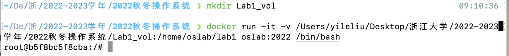
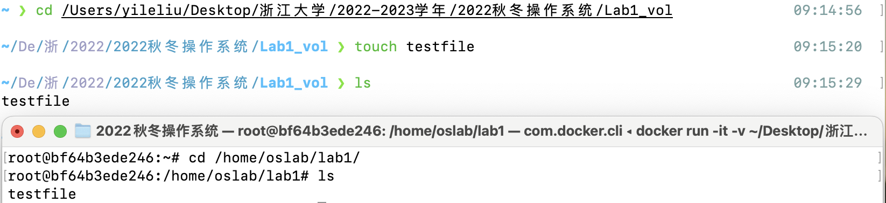

# Lab 1: RV64 内核引导

## 1 实验目的


学习 RISC-V 相关知识，了解 OpenSBI 平台，实现 sbi 调用函数，封装打印函数，并利用 Makefile 来完成对整个工程的管理。


## 2 实验内容及要求


- 阅读 RISC-V 中文手册，学习 RISC-V 相关知识
- 学习 Makefile 编写规则，补充 Makefile 文件使得项目成功运行
- 了解 OpenSBI 的运行原理，编写代码通过 sbi 调用实现字符串的打印

请各位同学独立完成实验，任何抄袭行为都将使本次实验判为0分。


**请跟随实验步骤完成实验并根据文档中的要求记录实验过程，最后删除文档末尾的附录部分**，并命名为 **“学号_姓名_lab1.pdf”** ，你的代码请打包并命名为 **“学号_姓名_lab1.zip/tar/..”**，文件一并上传至学在浙大平台。


## 3 实验步骤


### 3.1 搭建实验环境（10%）


请按照以下方法创建新的容器，并建立 volume 映射([参考资料](https://kebingzao.com/2019/02/25/docker-volume/))。建立映射后，你可以方便的在本地编写代码，并在容器内进行编译检查。未来的实验中同样需要用该方法搭建相应的实验环境，但不再作具体指导，请理解每一步的命令并自行更新相关内容。


> 当然，如果你使用 VSCode 或其他具有直接连接 Docker 容器功能的软件，你也可以直接在 Docker 容器内进行编辑，而无需建立映射关系，如若此，请提供你使用软件直接在 Docker 容器内进行编辑的截图即可。


#### 3.1.1 创建容器并建立映射关系


指令仅做参考，注意修改指令中的路径为你自己设置的路径。


```shell
# 首先请在本地新建一个目录用作映射需要
$ mkdir lab1

# 创建新的容器，同时建立 volume 映射
$ docker run -it -v /path/to/your/local/dir:/home/oslab/lab1 oslab:2022 /bin/bash
oslab@3c1da3906541:~$
```

**请在此处添加一张你执行 Docker 映射的命令及结果截图：**
答：


#### 3.1.2 测试映射关系


为测试映射关系是否成功，你可以在本地映射目录中创建任意文件，并在 Docker 容器中进行检查。


```shell
# 在你的本地映射目录中，创建任意文件
$ cd /path/to/your/local/dir
$ touch testfile
$ ls
testfile
```


以上指令将在你的本地映射目录创建一个文件，接下来在容器中执行指令进行检查。


```shell
# 在 Docker 容器中确认是否挂载成功
root@dac72a2cc625:/home/oslab/lab1$ ls
testfile
```


可以看到创建的文件存在，证明映射关系建立成功，接下来你可以使用你喜欢的 IDE 在该目录下进行后续实验的编码了。

**请在此处添加你测试映射关系的全指令截图：**
答：


### 3.2 了解项目框架，编写 MakeFile（20%）


#### 3.2.1 编写 Makefile 文件


本实验提供的代码框架结构如图，你可以点击[lab1.zip](https://yuque.zju.edu.cn/attachments/yuque/0/2022/zip/25434/1662738216670-3405e47c-675f-41f7-bce5-e9b220450ad8.zip?_lake_card=%7B%22uid%22%3A%221662738216521-0%22%2C%22src%22%3A%22https%3A%2F%2Fyuque.zju.edu.cn%2Fattachments%2Fyuque%2F0%2F2022%2Fzip%2F25434%2F1662738216670-3405e47c-675f-41f7-bce5-e9b220450ad8.zip%22%2C%22name%22%3A%22lab1.zip%22%2C%22size%22%3A16047%2C%22type%22%3A%22application%2Fzip%22%2C%22ext%22%3A%22zip%22%2C%22progress%22%3A%7B%22percent%22%3A99%7D%2C%22status%22%3A%22done%22%2C%22percent%22%3A0%2C%22id%22%3A%22fO5wr%22%2C%22card%22%3A%22file%22%7D) 进行下载。


```shell
.
├── arch
│   └── riscv
│       ├── boot
│       ├── include
│       │   ├── print.h
│       │   ├── sbi.h
│       │   └── test.h
│       ├── kernel
│       │   ├── head.S
│       │   ├── main.c (需修改数字为学号)
│       │   ├── Makefile
│       │   ├── sbi.c (需通过内联汇编实现sbi调用)
│       │   ├── test.c
│       │   └── vmlinux.lds
│       ├── libs
│       │   ├── Makefile (需补充完整 Makefile 使项目正确编译)
│       │   └── print.c (需编写字符串打印函数及数字打印函数)
│       └── Makefile
├── include
│   └── defs.h
└── Makefile
```


1. 首先，请下载相关代码，并移动至你所建立的本地映射文件夹中。
1. 接下来请你参考【附录A.Makefile介绍】学习 Makefile 的基本知识。
1. 阅读项目中所有的 Makefile 文件，确保你理解了 Makefile 文件中每一行的作用（一些参数配置等不做要求）。


**请补充完整 `./arch/riscv/libs/Makefile` 文件使得整个项目能够顺利编译，最后，将你的代码补充在下方的代码框中。**

**你需要确保 `make` 指令和 `make clean` 指令均可正常运行，如果运行成功会显示绿色的 Success 字样提示。**


```makefile
# ./arch/riscv/libs/Makefile 
# YOUR MAKEFILE CODE

# $(wildcard *.c) 可以获取当前目录下的所有的 .c 文件列表
ASM_SRC   = $(sort $(wildcard *.S))
C_SRC     = $(sort $(wildcard *.c))

# $(patsubst 原模式, 目标模式, 文件列表)
OBJ		  = $(patsubst %.S,%.o,$(ASM_SRC)) $(patsubst %.c,%.o,$(C_SRC))

# 你可以通过 @echo 输出这些变量, 来查看他们起到了什么样的作用

all: $(OBJ)

%.o:%.S
	$(CC) $(CFLAG) -c $<
%.o:%.c
	$(CC) $(CFLAG) -c $<

clean:
	$(shell rm *.o 2>/dev/null)
	
# 所以追加 2>/dev/null 在命令末尾，表示：把错误输出到 “黑洞”。

# 1、Linux系统预留可三个文件描述符：0、1、2，意义如下：
# 0——标准输入（stdin）
# 1——标准输出（stdout）即输入到终端
# 2——标准错误（stderr）

# 2、重定向的符号有两个：> 和 >>，两者的区别是：前者是直接覆盖原有内容，即先清空文件，然后再写入内容；后者会将重定向的内容追加到现有文件的尾部。

# 3、/dev/null 是一个特殊的设备文件，这个文件接收到任何数据都会被丢弃。因此，null 这个设备通常也被称为位桶（bit bucket）或黑洞。

# 综上，2>/dev/null 的意思就是将标准错误 stderr 删掉。
```


#### 3.2.2 解释 Makefile 命令

**请参考下述例子解释 `lab1/Makefile`中的下列命令：**


```makefile
$(LD) -T arch/riscv/kernel/vmlinux.lds arch/riscv/kernel/*.o arch/riscv/libs/*.o -o vmlinux
```


含义：`$(LD)` 展开为 `riscv64-unknown-elf-ld`，即链接命令。`-T arch/riscv/kernel/vmlinux.lds` 选项表示使用 `vmlinux.lds` 作为链接器脚本。`-o vmlinux` 选项指定输出文件的名称为 `vmlinux`，整行命令的意思是将 `arch/riscv/kernel/*.o` 和 `arch/riscv/libs/*.o` 根据 `vmlinux.lds` 链接形成 `vmlinux`。


```shell
${OBJCOPY} -O binary vmlinux arch/riscv/boot/Image
```


含义：`${OBJCOPY}`是一个Linux命令，使用BFD库来读写目标文件，它可以将一个文件的内容拷贝到另一个文件。`-O `用于指定输出文件的bfdname， `-O binary`表示以二进制文件形式写入。`vmlinux`与`arch/riscv/boot/Image`分别是输出文件和输入文件的相对路径。整行命令表示打开`arch/riscv/boot/Image`文件并以二进制形式将其写入到`vmlinux`文件中。


```makefile
${MAKE} -C arch/riscv all
```

含义：`${MAKE}`即make；`-C arch/riscv`展开为`-directory=arch/riscv`，表示先进入到目录arch/riscv文件夹下再执行make；`all`是make命令，与makefile文件内容有关。整行命令的意思是先进入到arch/riscv文件夹下，再执行其中makefile的all命令。

**请解释** **`lab1/arch/riscv/kernel/Makefile`** **中的下列命令：**


```makefile
%.o:%.c
	${CC}  ${CFLAG}  -c $<
```


含义：`%.o:%.c`表示所有的.o文件都依赖于与其同名的.c文件。`${CC}`是指向编译器的宏，`${CFLAG}`是预先写好的编译参数，`-c`表示这里只编译不连接，`$<`是一个自动变量，表示依赖的第一个文件，这里即与.o同名的.c文件。整行命令的意思是make任何.o文件时都自动找到同名的.c文件作为依赖并按照`${CFLAG}`中的参数进行编译。


### 3.3 学习 RISC-V 相关知识及特权架构（10%）


后续实验中将持续使用 RISC-V 指令集相关的内容，请参考【附录B.RISC-V指令集】了解相关知识，**下载并认真阅读 [RISC-V 手册](https://github.com/riscv-non-isa/riscv-asm-manual/blob/master/riscv-asm.md)，掌握基础知识、基本命令及特权架构相关内容。**

#### 3.3.1 基础命令掌握情况


请按照下面提供的例子，补充完整各指令含义。


```makefile
# 加载立即数 0x40000 到 t0 寄存器中
li t0,0x40000

# 将寄存器t0中的值写入到scr寄存器中
csrw satp, t0

# 将t0-t1的结果赋给t0
sub t0, t0, t1

# 将x1寄存器中64bit的值存到mem[sp+8]位置
sd x1, 8(sp)

# 将stack_top这个label对应的地址存到sp
la sp, stack_top
```


### 3.4 通过 OpenSBI 接口实现字符串打印函数（60%）


#### 3.4.1 程序执行流介绍


对于本次实验，我们选择使用 OpenSBI 作为 bios 来进行机器启动时 m 模式下的硬件初始化与寄存器设置，并使用 OpenSBI 所提供的接口完成诸如字符打印等操作。


请参考【附录B.OpenSBI介绍】了解 OpenSBI 平台的功能及启动方式，参考【附录D. Linux Basic】了解`vmlinux.lds`、`vmlinux` 的作用，理解执行 `make run` 命令时程序的执行过程。


```shell
# make run 依赖 vmlinux
# 因此，他首先会编译目标 vmlinux 然后执行 lab1/Makefile 中的该行命令
@qemu-system-riscv64 -nographic --machine virt -bios default -device loader,file=vmlinux,addr=0x80200000 -D log
```


QEMU 模拟器完成从 ZSBL 到 OpenSBI 阶段的工作，本行指令使用 -bios default 选项将 OpenSBI 代码加载到0x80000000 起始处，并在 OpenSBI 初始化完成后，跳转到 0x80200000 处。因此，我们还需要将自己编译出的 `vmlinux` 程序加载至地址 0x80200000 处。


`vmlinux.lds` 链接脚本就可以帮助我们完成这件事情。它指定了程序的内存布局，最先加载的 `.text.init` 段代码为 `head.S` 文件的内容，该部分代码会执行调用 `main()` 函数。`main()` 函数调用了两个打印函数，打印函数通过 `sbi_call()` 向 OpenSBI 发起调用，完成字符的打印。


#### 3.4.2 编写 sbi_call() 函数（20%）


当系统处于 m 模式时，对指定地址进行写操作便可实现字符的输出。但我们编写的内核运行在 s 模式，需要使用 OpenSBI 提供的接口，让运行在 m 模式的 OpenSBI 帮助我们实现输出。即，运行在 s 模式的内核通过调用 `ecall`  指令（汇编级指令）发起 sbi 调用请求，接下来 RISC-V CPU 会从 s 态跳转到 m 态的 OpenSBI 固件中。


执行 `ecall` 前需要指定 sbi 调用的编号，传递的参数。一般而言：

- `a6` 为 SBI 调用 `Function ID` 编号
- `a7` 为 SBI 调用 `Extension ID` 编号
- `a0`、`a1` 、`a2` 、`a3` 、`a4` 、`a5` 寄存器存放 SBI 的调用参数，不同的函数对于传递参数要求也不同。

简单来讲，你可以认为我们需要填好 `a0` 到 `a7` 这些寄存器的值，调用 `ecall` 后，OpenSBI 会根据这些值做相应的处理。以下是一些常用的函数表。

| Function Name                        | Function ID | Extension ID |
| :----------------------------------- | :---------- | :----------- |
| sbi_set_timer （设置时钟相关寄存器） | 0           | 0x00         |
| sbi_console_putchar （打印字符）     | 0           | 0x01         |
| sbi_console_getchar （接收字符）     | 0           | 0x02         |
| sbi_shutdown （关机）                | 0           | 0x08         |


你需要编写内联汇编语句以使用 OpenSBI 接口，本实验给出的函数定义如下：（注意：本实验是 64 位 riscv 程序，这意味着我们使用的寄存器都是 64 位寄存器）


```c
typedef unsigned long long uint64_t;
struct sbiret {
  uint64_t error;
  uint64_t value;
};

struct sbiret sbi_call(uint64_t ext, uint64_t fid, uint64_t arg0, uint64_t arg1,
                       uint64_t arg2, uint64_t arg3, uint64_t arg4,
                       uint64_t arg5);
```


在该函数中，你需要完成以下内容：


- 将 ext (Extension ID) 放入寄存器 a7 中，fid (Function ID) 放入寄存器 a6 中，将 arg0 ~ arg5 放入寄存器 a0 ~ a5 中。
- 使用 ecall 指令。ecall 之后系统会进入 M 模式，之后 OpenSBI 会完成相关操作。
- OpenSBI 的返回结果会存放在寄存器 a0 ， a1 中，其中 a0 为 error code， a1 为返回值， 我们用 sbiret  结构来接受这两个返回值。

请参考【附录C.内联汇编】相关知识，以内联汇编形式实现 `lab1/arch/riscv/kernel/sbi.c` 中的 `sbi_call()` 函数。


最后，请将你编写好的 `sbi_call` 函数复制到下面代码框内。


```c
// lab1/arch/riscv/kernel/sbi.c

#include "defs.h"

struct sbiret sbi_call(uint64_t ext, uint64_t fid, uint64_t arg0, uint64_t arg1,
                       uint64_t arg2, uint64_t arg3, uint64_t arg4,
                       uint64_t arg5) {
  struct sbiret ret;
  // __asm__ volatile(
  //     // Your code
  // );
  return ret;
}

```


#### 3.4.3 编写字符串打印函数（40%）


现在你已经有了一个 C 语言层面的 `sbi_call` 接口函数，因此，后面的代码中，你只需要调用这个接口函数即可，并不需要再写汇编代码。


本节，你需要在 `./arch/riscv/libs/print.c` 文件中通过调用 `sbi_call()` 实现字符串打印函数 `int puts(char* str)` 及数字打印函数 `int put_num(uint64_t n)`，后者可将数字转换为字符串后调用前者执行。


提示：上节已经给出了你一个 OpenSBI 调用函数表，具体使用方法可参考[OpenSBI 文档](https://github.com/riscv/riscv-sbi-doc/blob/master/riscv-sbi.adoc#function-listing-1)。为了利用 OpenSBI 接口打印字符，我们需要向 `sbi_call()` 函数传入 `ext=1, fid=0` 以调用 `sbi_console_putchar(int ch)` 函数，之后，第一个参数 `arg0` 需要传入待打印字符的 ASCII 码，其余没有用到的参数可直接设为0。


最后，请将你编写好的函数复制到下面代码框内。


```c
// ./arch/riscv/libs/print.c

#include "defs.h"
extern struct sbiret sbi_call(uint64_t ext, uint64_t fid, uint64_t arg0,
                              uint64_t arg1, uint64_t arg2, uint64_t arg3,
                              uint64_t arg4, uint64_t arg5);

#define PUT_NUM_STR_LEN 12

int puts(char *str)
{
  // your code
  int index = 0;
  char c = str[index];
  while (c != '\0')
  {
    sbi_call(0x01, 0, c, 0, 0, 0, 0, 0);
    index++;
    c = str[index];
  }
}

int put_num(uint64_t n)
{
  // your code
  int index = PUT_NUM_STR_LEN - 1;
  char str[PUT_NUM_STR_LEN] = "";
  str[PUT_NUM_STR_LEN - 1] = 0;
  while (n > 0)
  {
    index--;
    str[index] = n % 10 + '0';
    n = n / 10;
  }
  char *newStr = str + index;
  puts(newStr);
  return 0;
}
```


### 3.5 编译及测试


在 `lab1/arch/riscv/kernel/main.c` 中将 `21922192` 修改为你的学号，在项目最外层输入 `make run` 命令调用 Makefile 文件完成整个工程的编译及执行。


**如果编译失败，及时使用`make clean`命令清理文件后再重新编译。**


如果程序能够正常执行并打印出相应的字符串及你的学号，则实验成功。预期的实验结果如下。


```shell
oslab@3c1da3906541:~/lab1$ make run
......
......
......
Hello RISC-V!
21922192
```

请在此附上你的实验结果截图。


## 4 讨论和心得


不太明白的地方是为什么实验最后一步`make run`之后程序会不断重复执行，从而必须用一个死循环进行阻塞，这似乎与我们平时的C语言代码不同。
