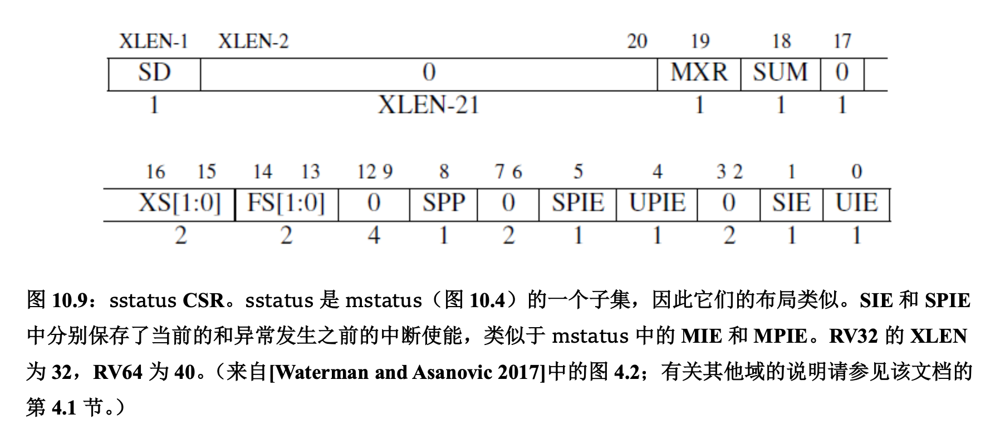
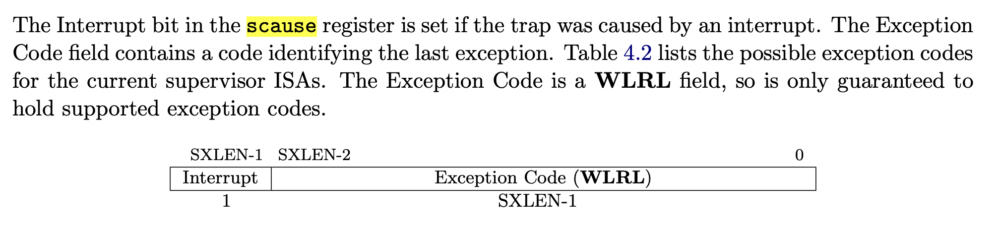
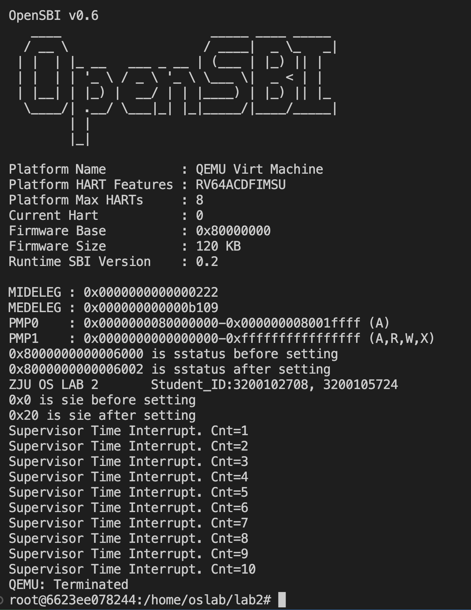
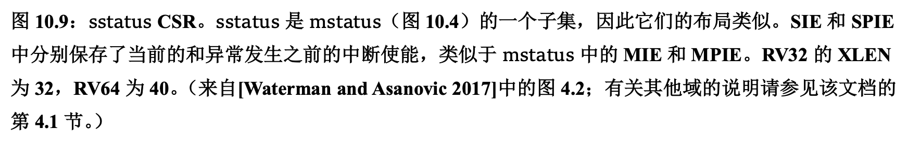

# Lab 2: RV64 时钟中断处理

## 1 实验目的


以时钟中断为例学习在RISC-V上的异常处理相关机制。


## 2 实验内容及要求


- 理解 RISC-V 异常委托与异常处理机制
- 利用 OpenSBI 平台的 SBI 调用触发时钟中断，并通过代码设计实现定时触发时钟中断的效果


请各位同学独立完成实验，任何抄袭行为都将使本次实验判为0分。

**请跟随实验步骤完成实验并根据文档中的要求记录实验过程，最后删除文档末尾的附录部分**，并命名为“`学号_姓名_lab2.pdf`”，你的代码请打包并命名为“`学号_姓名_lab2.zip/tar/..`”，文件一并上传至学在浙大平台。

## 3 实验步骤

### 3.1 搭建实验环境，理解实验执行流程


请同学们认真阅读 [RISC-V中文手册](https://www.yuque.com/imm/XlE5Gl4VFTeHBxfAeUwUXA%3D%3D%7Ceq21wbOJYMaU%2BSwn87A5xTj8A6RrThodjzKMrnJRLDFJVQKSJ2nqQDYAWOiHBWWZqSVEOdpLf%2FWQOhlGuXDlLw%3D%3D?x-yuque-pt-cb=&x-yuque-pt-expires=1662886493767&x-yuque-pt-id=57390&x-yuque-pt-signature=Vkdo5QBS7YAuZzbmTF%2F32zKnp1Y%3D) 中的【第十章 RV32/64 特权架构】，对异常及特权模式进行一个系统性的了解，与本实验相关的内容已总结至附录中，可按顺序阅读。


本次实验的目标是**定时触发时钟中断并在相应的中断处理函数中输出相关信息**。


代码实现逻辑如下：


- 在初始化阶段，设置 CSR 寄存器以允许 S 模式的时钟中断发生，利用 SBI 调用触发第一次时钟中断。
- SBI 调用触发时钟中断后，OpenSBI 平台触发了 S 模式下的时钟中断，接下来会进入程序设置好的（汇编级）中断函数中。中断函数保存寄存器现场后会调用（C 语言级）中断处理函数。
- 在中断处理函数中打印相关信息，并设置下一次时钟中断，从而实现定时（每隔一秒执行一次）触发时钟中断并打印相关信息的效果。函数返回后恢复寄存器现场，调用 S 模式异常返回指令 sret 回到发生中断的指令。


为了完成实验，需要同学们在 `init.c` 中设置 CSR 寄存器允许时钟中断发生，在 `clock.c` 中触发时钟中断事件，在 `entry.S` 及 `trap.c` 中编写中断处理函数。


#### 3.1.1 创建容器，映射文件夹


你可以复用 Lab 1 中映射好的文件夹，也可以重新创建一个容器做映射。


#### 3.1.2 理解组织文件结构


你可以点击 [Lab 2_ 代码.zip](https://yuque.zju.edu.cn/attachments/yuque/0/2022/zip/25434/1662827402220-aa8ee78b-2ded-4ade-8084-3c982ceb8cd6.zip?_lake_card=%7B%22uid%22%3A%221662827402043-0%22%2C%22src%22%3A%22https%3A%2F%2Fyuque.zju.edu.cn%2Fattachments%2Fyuque%2F0%2F2022%2Fzip%2F25434%2F1662827402220-aa8ee78b-2ded-4ade-8084-3c982ceb8cd6.zip%22%2C%22name%22%3A%22Lab+2_+%E4%BB%A3%E7%A0%81.zip%22%2C%22size%22%3A16103%2C%22type%22%3A%22application%2Fzip%22%2C%22ext%22%3A%22zip%22%2C%22progress%22%3A%7B%22percent%22%3A99%7D%2C%22status%22%3A%22done%22%2C%22percent%22%3A0%2C%22id%22%3A%22geip6%22%2C%22card%22%3A%22file%22%7D) 下载代码，项目代码结构如下所示。


```c
Lab2
├──  arch
│  └──  riscv
│     ├──  boot
│     ├──  kernel
│     │  ├──  clock.c
│     │  ├──  entry.S
│     │  ├──  head.S
│     │  ├──  init.c
│     │  ├──  main.c
│     │  ├──  Makefile
│     │  ├──  print.c
│     │  ├──  sbi.c
│     │  ├──  trap.c
│     │  └──  vmlinux.lds
│     └──  Makefile
├──  include
│  ├──  defs.h
│  ├──  riscv.h
│  └──  test.h
└──  Makefile
```


**首先请同学们参照自己 Lab 1 中写的代码补充完整 `print.c` 以及 `sbi.c` 中的 `sbi_call()` 函数。**

#### 3.3.3 修改必要文件


裸机程序从 `.text` 段起始位置执行，所以需要利用 `vmlinux.lds` 中 `.text` 段的定义来确保 `head.S` 中的 `.text` 段被放置在其他 `.text` 段之前。这可以通过重命名来解决。


首先将 `head.S` 中的 `.text` 命名为 `.text.init`：


```asm
<<<<< before
.section .text
============
.section .text.init
>>>>> after
```


接下来将 `entry.S` 中的 `.text` 命名为 `.text.entry`：


```asm
<<<<< before
.section .text
============
.section .text.entry
>>>>> after
```


然后修改 `vmlinux.lds` 文件中的 `.text` 展开方式：


```asm
<<<<< before 
.text : {
		*(.text)
		*(.text.*)
	 }
============
.text : {
		*(.text.init)
		*(.text.entry)
		*(.text)
		*(.text.*)
	 }
>>>>> after
```

**如果你没有理解这段代码为什么这样修改，请重新阅读 Lab 1 文档中【附录 D】部分的说明。**

### 3.2 编写 init.c 中的相关函数（20%）


首先，我们需要开启 S 模式下的中断总开关，需要对以下寄存器进行设置：


1. 设置 `stvec` 寄存器。`stvec` 寄存器中存储着 S 模式下发生中断时跳转的地址，我们需要编写相关的中断处理函数，并将地址存入 `stvec` 中。
1. 将 `sstatus` 寄存器中的 `sie` 位打开。`sstatus[sie]` 位为 S 模式下的中断总开关，这一位为 1 时，才能响应中断。


#### 3.2.1 编写 `intr_enable()`/`intr_disable()`


这两个函数的作用如下注释。你需要使用 CSR 命令设置 `sstatus[sie]` 的值。本实验中在 `riscv.h` 文件中为你提供了一些宏定义，可以方便的使用 CSR 指令。当然，你也可以自行通过内联汇编实现。


> 提示：你需要根据 [RISC-V中文手册](https://www.yuque.com/imm/XlE5Gl4VFTeHBxfAeUwUXA%3D%3D%7Ceq21wbOJYMaU%2BSwn87A5xTj8A6RrThodjzKMrnJRLDFJVQKSJ2nqQDYAWOiHBWWZqSVEOdpLf%2FWQOhlGuXDlLw%3D%3D?x-yuque-pt-cb=&x-yuque-pt-expires=1662886493767&x-yuque-pt-id=57390&x-yuque-pt-signature=Vkdo5QBS7YAuZzbmTF%2F32zKnp1Y%3D) 中的【第十章 RV32/64 特权架构】中的内容确定 sstatus 寄存器的 sie 位是第几位，从而为该位赋 1。


**请在下方代码框中补充完整你的代码：**


```c
void intr_enable(void)
{
  // 设置 sstatus[sie] = 1, 打开 s 模式的中断开关

  write_csr(sstatus, read_csr(sstatus)|0x0000000000000002);
//   set_csr(sstatus, 1);

}

void intr_disable(void)
{
  // 设置 sstatus[sie] = 0, 关闭 s 模式的中断开关
 
  write_csr(sstatus, read_csr(sstatus)&0xFFFFFFFFFFFFFFFD);
//   clear_csr(sstatus, 1);
}
```

**请对你的代码做简要解释：**
答：// set_csr()函数调用似乎无法改动csr，故采用write_csr()将read_csr()得到的值作bit mask再存回。




`sstatus[sie]`即`CSR sstatus[1]`。故set时应和0x0000000000000002进行逻辑或，clear时应和0xFFFF FFFF FFFF FFFD进行逻辑与。

#### 3.2.2 编写 `idt_init()`


该函数需要你向 `stvec` 寄存器中写入中断处理后跳转函数的地址，在本实验中，我们的中断处理函数是 `trap_s` 这个函数。


> 提示：C 语言中，可以使用取地址符和函数名，获取函数的地址。

**请在下方代码框中补充完整你的代码：**


```c
void idt_init(void)
{
  extern void trap_s(void);
  // 向 stvec 寄存器中写入中断处理后跳转函数的地址
  write_csr(stvec, &trap_s);
}
```


### 3.3 编写 `clock.c` 中的相关函数（30%）


我们的时钟中断需要利用 OpenSBI 提供的 `sbi_set_timer()` 接口触发，**向该函数传入一个时刻，OpenSBI 在那个时刻将会触发一次时钟中断**。


我们需要“**每隔若干时间就发生一次时钟中断**”，但是 OpenSBI 提供的接口一次只能设置一个时钟中断事件。本实验采用的方式是：一开始设置一个时钟中断，之后每次发生时钟中断的时候，在相应的中断处理函数中设置下一次的时钟中断。这样就达到了每隔一段时间发生一次时钟中断的目的。


对于代码而言，在文件 `clock.c` 中：

- `clock_init()` 函数将会启用时钟中断并设置第一个时钟中断
- `clock_set_next_event()` 用于调用 OpenSBI 函数 `set_sbi_timer()` 触发时钟中断。
- `get_cycles()` 函数是已经为你提供好的函数。其通过 `rdtime` 伪指令读取一个叫做 `time` 的 CSR 寄存器数值，表示 CPU 启动之后经过的真实时间。


#### 3.3.1 修改时钟中断间隔


QEMU 中外设晶振的频率为 10mhz，即每秒钟 `time` 的值将会增大 。我们可以据此来计算每次 `time` 的增加量，以控制时钟中断的间隔。

**为了使得每次时钟中断的间隔为 1 秒，`timebase`（即`time`的增加量）需要设置为？**
答：1e7，即$1\times 10^7$。


#### 3.3.2 编写 `clock_init()`

**请根据注释在下方代码框中补充完整你的代码：**


```c
void clock_init(void)
{
  puts("ZJU OS LAB 2       Student_ID:3200102708, 3200105724\n");

  // 对 sie 寄存器中的时钟中断位设置（ sie[stie] = 1 ）以启用时钟中断
  
  put_hex(read_csr(sie));
  puts(" is sie before setting\n");
//   set_csr(sie, 5);
  write_csr(sie, read_csr(sie)|0x0000000000000020);
  put_hex(read_csr(sie));
  puts(" is sie after setting\n");
  // 设置第一个时钟中断
  sbi_set_timer(get_cycles() + timebase);
  ticks = 0;
  // your code
}

```


#### 3.3.3 编写 `clock_set_next_event()`


> 提示：你需要调用 OpenSBI 提供的接口 `sbi_set_timer()` ，你需要通过 Lab 1 中编写好的 sbi_call 函数调用他。该函数对应的 Function ID 为 0，Extension ID 也为 0，接收一个参数 (arg0)，表示触发时钟中断的时间点。


**请根据注释在下方代码框中补充完整你的代码：**


```c
#define sbi_set_timer(target_time) sbi_call(0, 0, target_time, 0, 0, 0, 0, 0);

void clock_set_next_event(void)
{
  // 获取当前 cpu cycles 数并计算下一个时钟中断的发生时刻
  // 通过调用 OpenSBI 提供的函数触发时钟中断
  sbi_set_timer(get_cycles() + timebase);
  ticks++;
}
```

### 3.4 编写并调用中断处理函数（50%）

#### 3.4.1 在 `entry.S` 中编写中断处理函数（30%）


在【3.1】中，我们向 `stvec` 寄存器存入了中断处理函数的地址，中断发生后将自动进行硬件状态转换，程序将读取 `stvec` 的地址并进行跳转，运行 `trap_s` 函数。该函数该函数需要在栈中保存 `caller saved register` 及 `sepc` 寄存器，读取 `scause` 这个 CSR 寄存器并作为参数传递给 `handle_s` 函数进行中断处理，调用返回后需要恢复寄存器并使用 `sret` 命令回到发生中断的指令。


> **提示**：你可以参考 [RISC-V中文手册](https://www.yuque.com/imm/XlE5Gl4VFTeHBxfAeUwUXA%3D%3D%7Ceq21wbOJYMaU%2BSwn87A5xTj8A6RrThodjzKMrnJRLDFJVQKSJ2nqQDYAWOiHBWWZqSVEOdpLf%2FWQOhlGuXDlLw%3D%3D?x-yuque-pt-cb=&x-yuque-pt-expires=1662886493767&x-yuque-pt-id=57390&x-yuque-pt-signature=Vkdo5QBS7YAuZzbmTF%2F32zKnp1Y%3D) 3.2 节相关内容完成实验；本实验中寄存器大小为 8 字节；需要使用 CSR 命令操作 CSR 寄存器；若不清楚 `caller saved register` ，也可将寄存器全都保存；对汇编语言不是特别了解的建议把中文手册读一遍，或在网上自行学习汇编语言基本的函数调用约定知识。

**请根据注释在下方代码框中补充完整你的代码：**


```asm
.section .text.entry

.global trap_s
.extern handler_s
.equ reg_size, 0x8
.align 2

trap_s:
	# save caller-saved registers and sepc
    sd ra, 0(sp)
    sd t0, 8(sp)
    sd t1, 16(sp)
    sd t2, 24(sp)
    sd a0, 32(sp)
    sd a1, 40(sp)
    sd a2, 48(sp)
    sd a3, 56(sp)
    sd a4, 64(sp)
    sd a5, 72(sp)
    sd a6, 80(sp)
    sd a7, 88(sp)
    sd t3, 96(sp)
    sd t4, 104(sp)
    sd t5, 112(sp)
    sd t6, 120(sp)
    # read the csr sepc to general reg, then push
    csrr t0, sepc
    sd t0, 128(sp)
    addi sp, sp, 128; # sp = t1 + imm
    
    
	# call handler_s(scause)
		csrr a0, scause
    call handler_s

	# load sepc and caller-saved registers
    addi t0, zero, 128; # t0 = t1 + imm
    sub t0, t1, t2 # t0 = t1 - t2

    ld t0, 128(sp)
    csrw sepc, t0

    ld ra, 0(sp)
    ld t0, 8(sp)
    ld t1, 16(sp)
    ld t2, 24(sp)
    ld a0, 32(sp)
    ld a1, 40(sp)
    ld a2, 48(sp)
    ld a3, 56(sp)
    ld a4, 64(sp)
    ld a5, 72(sp)
    ld a6, 80(sp)
    ld a7, 88(sp)
    ld t3, 96(sp)
    ld t4, 104(sp)
    ld t5, 112(sp)
    ld t6, 120(sp)

	sret
```

**为什么需要保存 sepc 寄存器：**
答：为中断之后通过恢复中断前的 sepc，回到之前的指令。每次中断都需要保存sepc，这样还可以实现嵌套中断而不出现错误。

#### 3.4.2 在 `trap.c` 中编写中断处理函数（20%）


正常情况下，异常处理函数需要根据 `[m|s]cause` 寄存器的值判断异常的种类后分别处理不同类型的异常，但在本次实验中简化为只判断并处理时钟中断。

【3.3】中提到，为了实现"定时触发中断"，我们需要在该函数中继续设置下一次的时钟中断。此外，为了进行测试，中断处理函数中还需要打印时钟中断发生的次数，你需要在 `clock.c` 中利用 `ticks` 变量进行统计，请更新【3.3】中相关代码，每设置一次时钟中断，便给 `ticks` 变量加一。

**触发时钟中断时，`scause`寄存器的值是？据此填写代码中的条件判断语句：**




答：SXLEN = 64，那么scause = 0x8000 0000 0000 0005。

**请根据注释在下方代码框中补充完整你的代码：**


```c
void handler_s(uint64_t cause)
{
  // interrupt
  if (cause >> 63) // highest bit as interrupt-bit which is set when interrupt occurs
  {
    // supervisor timer interrupt
    if (((cause << 1) >> 1) == 5)
    {
      // 设置下一个时钟中断，打印当前的中断数目。
      clock_set_next_event();
      puts("Supervisor Time Interrupt. Cnt=");
      put_num(ticks);
      puts("\n");
    }
  }
}
```

**【同步异常与中断的区别】当处理同步异常时应该在退出前给 `epc` 寄存器+4（一条指令的长度），当处理中断时则不需要，请解释为什么要这样做。（请阅读附录内容）**
答：发生同步异常的条件是当前指令不可执行，所以退出异常时应该给epc+4表示从发生异常的下一条语句开始执行；如果不+4则意味着再次尝试执行出错的语句，也就会再次同步异常。发生中断时当前的指令是可以且应该被正常执行的，所以退出中断时epc不需要+4。

### 3.5 编译及测试


请修改 `clock.c` 中的 `ID:123456`，确保输出自己的学号。仿照 Lab 1 进行运行测试，预期的实验结果为**每隔一秒触发一次时钟中断，打印一次信息**。

请在此附上你的运行结果截图。
答：

## 4 讨论和心得


请在此处填写实验过程中遇到的问题及相应的解决方式。

本实验本意是使用 OpenSBI 平台避免编写过多的汇编代码以简化实验，但是这样做之后省去了实际时钟中断处理时的复杂跳转，把整个过程简化得过于简单了。欢迎同学们对本实验提出建议。

- `riscv.h`中的`set_csr()`和`clear_csr()`宏，似乎没有用。使用`read_csv()` `write_csv()`倒是可以。

- `sd/ld` 的指令格式和手册中的有出入，lab0文档中的`sd/ld rs, imm(rd)`可以运行，但是imm只能使用十进制数或者表达式，不可以使用十六进制数或表达式，否则会报错非法操作数。

- 注意save_all时，通用寄存器和csr的顺序。csr需要存入临时寄存器，才能使用sd保存。但是临时寄存器也是caller-saved，所以应该分两步，保存完全部的caller-saved之后，再行转存csr。

- 

  

  中文手册中对XLEN长度定义有分歧，实验时暂且认为在RV64中XLEN是64。

- **待解决**，无法使用gdb进行调试，提示not being running，可以打断点但是无法执行、无法查看反汇编。本实验中调试采用自己实现的put_hex()函数查看符号和值，结合vscode的hex viewer检查可执行文件。


## 附录

### A. RISC-V 中的异常


异常 (trap) 是指是不寻常的运行时事件，由硬件或软件产生，当异常产生时控制权将会转移至异常处理程序。异常是操作系统最基础的概念，一个没有异常的操作系统无法进行正常交互。


RISC-V 将异常分为两类。一类是硬件中断 (interrupt)，它是与指令流异步的外部事件，比如鼠标的单击。另外一类是同步异常 (exception)，这类异常在指令执行期间产生，如访问了无效的存储器地址或执行了具有无效操作码的指令。


这里我们用异常 (trap) 作为硬件中断 (interrupt) 和同步异常 (exception) 的集合，另外 trap 指的是发生硬件中断或者同步异常时控制权转移到 handler 的过程。


> 本实验统一用异常指代 trap，中断/硬件中断指代 interrupt，同步异常指代 exception。


### B. M 模式下的异常


#### 硬件中断的处理（以时钟中断为例）


简单地来说，中断处理经过了三个流程：中断触发、判断处理还是忽略、可处理时调用处理函数。


- 中断触发：时钟中断的触发条件是 hart（硬件线程）的时间比较器 `mtimecmp` 小于实数计数器 `mtime`。
- 判断是否可处理：
   - 当时钟中断触发时，并不一定会响应中断信号。M 模式只有在全局中断使能位 `mstatus[mie]` 置位时才会产生中断，如果在 S 模式下触发了 M 模式的中断，此时无视 `mstatus[mie]` 直接响应，即运行在低权限模式下，高权限模式的全局中断使能位一直是 enable 状态。
   - 此外，每个中断在控制状态寄存器 `mie` 中都有自己的使能位，对于特定中断来说，需要考虑自己对应的使能位，而控制状态寄存器 `mip` 指示目前待处理的中断。
   - 以时钟中断为例，只有当 `mstatus[mie]`= 1，`mie[mtie]`= 1，且`mip[mtip]`= 1 时，才可以处理机器的时钟中断。其中 `mstatus[mie]` 以及 `mie[mtie]` 需要我们自己设置，而 `mip[mtip]` 在中断触发时会被硬件自动置位。
- 调用处理函数：
   - 当满足对应中断的处理条件时，硬件首先会发生一些状态转换，并跳转到对应的异常处理函数中，在异常处理函数中我们可以通过分析异常产生的原因判断具体为哪一种，然后执行对应的处理。
   - 为了处理异常结束后不影响 hart 正常的运行状态，我们首先需要保存当前的状态【即上下文切换】。我们可以先用栈上的一段空间来把**全部**寄存器保存，保存完之后执行到我们编写的异常处理函数主体，结束后退出。


#### M 模式下的异常相关寄存器


M 模式异常需要使用的寄存器有提到的 `mstatus`，`mie`，`mtvec` 寄存器，这些寄存器需要我们操作；剩下还有 `mip`，`mepc`，`mcause` 寄存器，这些寄存器在异常发生时**硬件会自动置位**，它们的功能如下：


- `mepc`：存放着中断或者异常发生时的指令地址，当我们的代码没有按照预期运行时，可以查看这个寄存器中存储的地址了解异常处的代码。通常指向异常处理后应该恢复执行的位置。
- `mcause`：存储了异常发生的原因。
- `mstatus`：Machine Status Register，其中 m 代表 M 模式。此寄存器中保持跟踪以及控制 hart (hardware thread) 的运算状态。通过对 `mstatus` 进行位运算，可以实现对不同 bit 位的设置，从而控制不同运算状态。
- `mie`、`mip`：`mie`以及`mip`寄存器是 Machine Interrup Registers，用来保存中断相关的一些信息，通过`mstatus` 上 mie 以及 mip 位的设置，以及 `mie` 和 `mip` 本身两个寄存器的设置可以实现对硬件中断的控制。注意 mip 位和 `mip` 寄存器并不相同。
- `mtvec`：Machine Trap-Vector Base-Address Register，主要保存M模式下的 trap vector（可理解为中断向量）的设置，包含一个基地址以及一个 mode。


与时钟中断相关的还有 `mtime` 和 `mtimecmp` 寄存器，它们的功能如下：


- `mtime`：Machine Time Register。保存时钟计数，这个值会由硬件自增。
- `mtimecmp`：Machine Time Compare Register。保存需要比较的时钟计数，当 `mtime` 的值大于或等于`mtimecmp` 的值时，触发时钟中断。


需要注意的是，`mtime` 和 `mtimecmp` 寄存器需要用 MMIO 的方式即使用内存访问指令（sd，ld等）的方式交互，可以将它们理解为 M 模式下的一个外设。


事实上，异常还与 `mideleg` 和 `medeleg` 两个寄存器密切相关，它们的功能将在 **S 模式下的异常**部分讲解，主要用于将 M 模式的一些异常处理委托给S模式。


#### 同步异常的处理


同步异常的触发条件是当前指令执行了未经定义的行为，例如：


- Illegal instruction：跳过判断可以处理还是忽略的步骤，硬件会直接经历一些状态转换，然后跳到对应的异常处理函数。
- 环境调用同步异常 ecall：主要在低权限的 mode 需要高权限的 mode 的相关操作时使用的，比如系统调用时 U-mode call S-mode ，在 S-mode 需要操作某些硬件时 S-mode call M-mode。


需要注意的是，不管是中断还是同步异常，都会经历相似的硬件状态转换，并跳到**同一个**异常处理地址（由`mtvec`/`stvec` 寄存器指定），异常处理函数根据 `mcause` 寄存器的值判断异常出现原因，针对不同的异常进行不同的处理。


### C. S 模式下的异常


由于 hart 位于 S 模式，我们需要在 S 模式下处理异常。这时首先要提到委托（delegation）机制。

#### 委托机制


**RISC-V 架构所有 mode 的异常在默认情况下都跳转到 M 模式处理**。为了提高性能，RISC-V支持将低权限mode 产生的异常委托给对应 mode 处理，该过程涉及了 `mideleg` 和 `medeleg` 这两个寄存器。


- `mideleg`：Machine Interrupt Delegation。该寄存器控制将哪些中断委托给 S 模式处理，它的结构可以参考 `mip` 寄存器，如 `mideleg[5]` 对应于 S 模式的时钟中断，如果把它置位， S 模式的时钟中断将会移交 S 模式的异常处理程序，而不是 M 模式的异常处理程序。
- `medeleg`：Machine Exception Delegation。该寄存器控制将哪些同步异常委托给对应 mode 处理，它的各个位对应 `mcause` 寄存器的返回值。


#### S 模式下时钟中断处理流程


事实上，即使在 `mideleg` 中设置了将 S 模式产生的时钟中断委托给 S 模式，委托仍未完成，因为硬件产生的时钟中断仍会发到 M 模式（`mtime` 寄存器是 M 模式的设备），所以我们需要**手动触发S模式下的时钟中断**。


此前，假设设置好 `[m|s]status` 以及 `[m|s]ie`，即我们已经满足了时钟中断在两种 mode 下触发的使能条件。接下来一个时钟中断的委托流程如下：


1. 当 `mtimecmp` 小于 `mtime` 时，**触发 M 模式时钟中断**，硬件**自动**置位 `mip[mtip]`。
1. 此时 `mstatus[mie]`  = 1，`mie[mtie]` = 1，且`mip[mtip]` = 1 表示可以处理 M 模式的时钟中断。
1. 此时 hart 发生了异常，硬件会自动经历状态转换，其中 `pc` 被设置为 `mtvec` 的值，即程序将跳转到我们设置好的 M 模式处理函数入口。
（注：`pc` 寄存器是用来存储指向下一条指令的地址，即下一步要执行的指令代码。）
1. M 模式处理函数将分析异常原因，判断为时钟中断，为了将时钟中断委托给 S 模式，于是将 `mip[stip]` 置位，并且为了防止在 S 模式处理时钟中断时继续触发 M 模式时钟中断，于是同时将 `mie[mtie]` 清零。
1. M 模式处理函数处理完成并退出，此时 `sstatus[sie]` = 1，`sie[stie]` = 1，且 `sip[stip]` = 1 (由于 sip 是 mip 的子集，所以第4步中令 `mip[stip]` 置位等同于将 `sip[stip]` 置位)，于是**触发 S 模式的时钟中断**。
1. 此时 hart 发生了异常，硬件自动经历状态转换，其中 `pc` 被设置为stvec，即跳转到我们设置好的 S 模式处理函数入口。
1. S 模式处理函数分析异常原因，判断为时钟中断，于是进行相应的操作，然后利用 `ecall` 触发异常，跳转到 M 模式的异常处理函数进行最后的收尾。
1. M 模式异常处理函数分析异常原因，发现为ecall from S-mode，于是设置 `mtimecmp` += 100000，将`mip[stip]` 清零，表示 S 模式时钟中断处理完毕，并且设置 `mie[mtie]` 恢复M模式的中断使能，保证下一次时钟中断可以触发。
1. 函数逐级返回，整个委托的时钟中断处理完毕。


#### 中断前后硬件的自动转换


当 `mtime` 寄存器中的的值大于 `mtimecmp` 时，`sip[stip]` 会被置位。此时，如果 `sstatus[sie]` 与 `sie[stie]` 也都是1，硬件会自动经历以下的状态转换（这里只列出 S 模式下的变化）：


- 发生异常的时 `pc` 的值被存入 `sepc`，且 `pc` 被设置为 `stvec`。
- `scause` 根据异常类型进行设置，`stval` 被设置成出错的地址或者其它特定异常的信息字。
- `sstatus` 中的 SIE 位置零，屏蔽中断，且中断发生前的 `sstatus[sie]` 会被存入 `sstatus[spie]`。
- 发生异常时的权限模式被保存在 `sstatus[spp]`，然后设置当前模式为 S 模式。


在我们处理完中断或异常，并将寄存器现场恢复为之前的状态后，**我们需要用 `sret` 指令回到之前的任务中**。`sret` 指令会做以下事情：


- 将 `pc` 设置为 `sepc`。
- 通过将 `sstatus` 的 SPIE 域复制到 `sstatus[sie]` 来恢复之前的中断使能设置。
- 并将权限模式设置为 `sstatus[spp]`。
