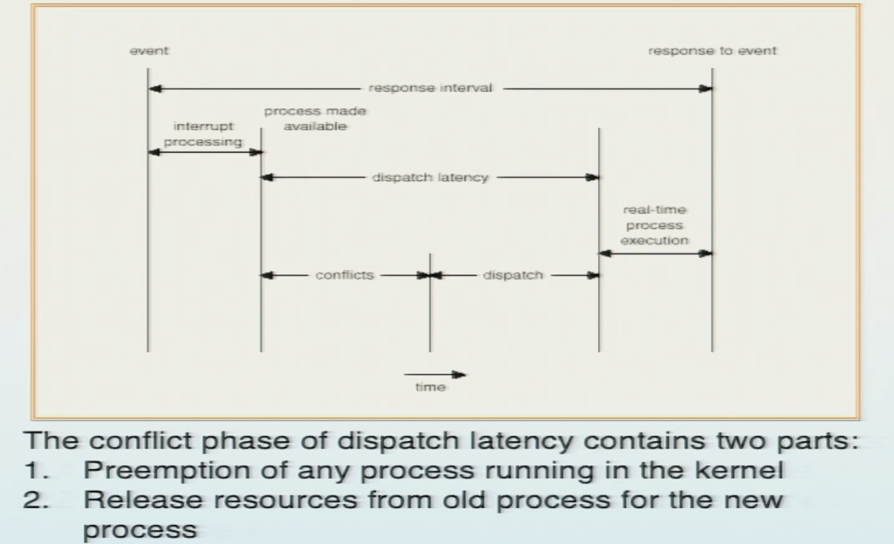
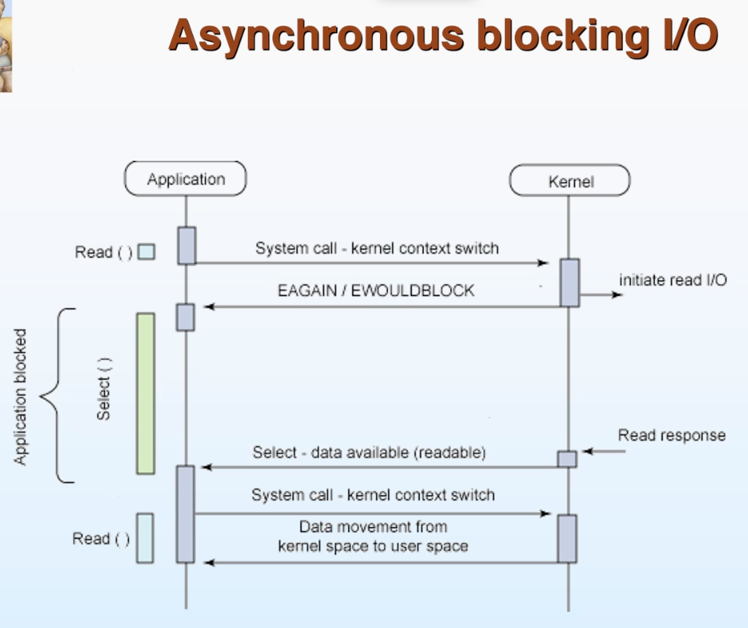

# 第三章 进程

## PCB


进程的状态，由操作系统控制切换。**注意进程是对上层应用而言的，操作系统本身不是一个进程。**


**PCB**是**内存**中由操作系统维护的特殊结构体，储存了各进程的相关信息。值得注意的是进程间切换时，CPU内部的运行上下文比如Reg、PC等也都要保存/恢复。**注意这里PCB是一个泛指，所有多进程操作系统都需要自己的PCB实现机制。在Linux中PCB是由task_struct结构体实现的。**

又因为显然内存比CPU内部资源慢得多，所以进程切换并不是越频繁越好。


上图是PCB工作的示例，CPU进程间的切换实质上就是不同PCB的存读档。

## Process Queue

- **Job queue** – set of all processes in the system
- **Ready queue** – set of all processes residing in main memory，ready and waiting to execute
- **Device queues** – set of processes waiting for an I/O device

每个设备都有一个队列。设备队列也就是等待队列，当设备给出响应之后进程就会被丢到Ready Queue。


调度算法又分为两（三）个部分：

- **Long-term Scheduler**控制进程进入Ready Queue等待
- **Short-term Scheduler**控制从Ready Queue中选择进程进入CPU执行


- **Medium-term Scheduler**控制CPU当前进程的切换以最大化利用处理器资源，这一部分大部分时候会被归入到Short-term Scheduler。

## Operations on Process

### Creation


**Linux下新建进程的方法本质都是`do_fork()`**，子进程先复制父进程的PCB（意味着完全继承了父进程的上下文），然后再执行独立的`exce()`，至此和父进程分道扬镳。

Linux下有3个特殊的进程，swapper/idle进程(PID = 0)，init进程(PID = 1，PPID = 0)和kthreadd(PID = 2，PPID = 0)：

- swap进程由系统自动创建，运行在内核态，是内核启动的其中一个步骤。其pid=0，是唯一一个没有通过`do_fork()`产生的进程。在启动结束后自动转为idle进程。
- init进程由idle通过`kernel_thread`（本质也是`do_fork()` ）创建，负责系统的初始化。首先Linux内核启动，然后在用户空间中启动init进程，再启动其他系统进程。**Linux中所有其他用户进程都是直接或间接由init进程创建并运行的。**在系统启动完成完成后，init将变为守护进程监视系统其他进程。
- kthreadd进程由idle通过`kernel_thread`创建，专门负责所有内核线程的调度和管理。**内核中的其他线程PPID都是2，说明这些线程都是由kthreadd进程创建的。**

```c
int main() {
    pid_t pid;
    pid = fork();
    if (pid < 0) {
        /* error occurred */
        fprintf(stderr, "Fork Failed");
        exit(-1);
    } else if (pid == 0) {
        /* child process */
        execlp("/bin/ls", "ls", NULL);
        printf("I'm Child");
    } else {
        /* parent process */
        // wait(NULL);
        printf("Child Complete");
        exit(0);
    }
}
```

上面是应用fork的一个例子，特别注意判断当前进程是不是父进程的条件：

- 在fork内部，新的进程会被创建并拥有和父进程一样的上下文
- 父进程的fork函数将子进程的pid返回给main
- 而子进程因为复制了父进程的PCB，同样会从fork返回到main，但是它并没有实际从main中调用fork，这时fork的返回值是0（由OS控制）

同时上面的程序还具有一些重要特点：

- **I‘m Child永远不会被输出，因为exec()不是普通的函数调用，而是子进程和父进程分道扬镳的路口，在exec之后子进程就去做自己的事情不会回来了**
- 在上面的例子里父进程的prinft输出和子进程ls输出不一定谁先谁后，因为它们两者地位时等同的，取决于处理器调度。但是如果在父进程中加一句wait就不一样了。

### Termination

了解为主


## Interprocess Communication

进程间协作（IPC）一般有两种实现方式：

- Message Passing：消息发送与接收
  - 如何建立可靠的连接？物理的还是逻辑的？
  - 消息收发只能在两个线程之间还是“群聊”？
- Shared Memory：共享内存
  - buffer的选取？
  - 读写冲突？
  - 内存安全？

无论哪一种实现方式，又都需要考虑信息的传递是否是同步的（阻塞的）。


进程同步会在后面的章节详细讨论。

# 第四章 线程

每个进程是一个程序，但是程序内部可能也需要并行计算，这就需要线程。


同一个进程下各个线程共享代码、文件资源、全局变量等等，因为他们是同一个程序的不同工作方向；但是他们的CPU上下文，包括寄存器和栈不能共享。进程有诸多状态，切换时需要维护的东西更多；线程切换时只需要更新CPU的上下文，他们共享同一片内存空间和状态。

## Multithreading Models

定性的了解多线程的执行方式是：**因为用户态下不允许直接操作切换CPU上下文，同时用户线程可能无穷无尽难以管理，所以OS只负责调用内核线程，内核线程再负责调度用户线程，相当于分级管理以降低每一级的复杂度。**

用户线程与系统线程的对应方式可以是一对一、一对多、多对一、多对多的；三者按先后顺序调度开销递减、灵活性递增，但是实现的复杂度同样递增。不同对应方式还可以混用，只要你写的出对应的调度器。

注意在使用一对多对应时，当个某个内核线程被切换，其上的所有用户进程也都会被阻塞。

## Light Weight Process

与普通进程相比，LWP与其他进程共享所有或大部分它的逻辑地址空间和系统资源；与线程相比，LWP有它自己的进程标识符，优先级，状态，以及栈和局部存储区，并和其他进程有着父子关系。

**LWP的一个重要作用是提供了一个用户级线程实现的中间系统。**LWP可以通过系统调用获得内核提供的服务，因此，当一个用户级线程运行时，只需要将它连接到一个LWP上便可以具有内核支持线程的所有属性。

而因为LWP之间共享它们的大部分资源，所以它在某些应用程序不适用，例如，为了避免内存泄漏和实现特权分隔，这时需要使用普通的多进程。

## Creation and Cancellation

创建线程与创建进程类似，本质都是先fork()后exec()。

结束进程时除了可以直接关闭线程删除相关上下文，还可以现为其赋flag表示弃用，OS稍后回收资源。

## Signal

用户调用系统功能借助systemcall；系统想要联系用户则需要signal。用户程序应该有signal_handler（可以是回调函数可以是监听端口）从系统接收消息。

## Thread Pool

线程池中存放了一系列后台进程对象。操作系统将计算任务维护为消息队列，并动态的将任务与线程匹配而不是直接为每个任务创建一个新线程。

线程池将**线程与任务分离**，从而实现线程的复用，节约创建、删除、反复切换线程的开销，同时在这个过程中还可以实现控制并发数量等等额外功能。

## Thread Structure

下面以一对一的关系为例说明线程需要维护那些信息。


## Java Thread State

Java自带的线程管理维护了每个线程有独立的状态。


# 第五章 CPU调度

回顾这张进程状态转换图，进程的转换无非四类：


## Dispatcher

调度器事负责决定谁此时应该被执行，而进行切换的具体事务交由分发器来做，大致包括：

- switching context
- switching to user mode
- jumping to the proper location in the user program to restart that program



下面将不专门区分调度器和分发器。

## 进程调度策略

调度策略优化的指标主要有：

- **CPU Utilization：**CPU资源利用率
- **Throughput：**吞吐量，单位之间内完成的进程任务数量
- **Turnaround Time：**周转时间，即单个进程从创建到结束所需的时间
- **Waiting Time：**等待时间，从任务到达到执行结束这段时间中，该任务没有在执行的时间
- **Response Time：**响应时间，从任务到达到开始执行的时间

下面介绍抽象的调度算法。

### FCFS

**First-Come First-Served先来先服务。**下面是一个例子，假设P1～P3在很短的时间内先后到达：


但是显然如果简单的将P1后置，等待时间将大幅度减少：


利用贪心算法很容易证明，先执行时间短的任务，整个队列的平均等待时间最少。

### SJF

**Shortest Job First短时任务优先。**

在这一节中我们引入到达时间，任务之间并不是同时到达的，于是调度算法细分为non-preemptive和preemtive两类：

- **non-preemtive：**非抢占式的，新进程到达不会打断当前正在执行的进程
- **preemptive：**抢占式的，如果新到达的进程运行时间小于当前进程剩余运行时间，根据SJF原则将当前的任务中断


容易数学证明，抢占式的SJF调度是等待时间单一维度下的最优算法。但是它的问题是，当任务量很多时，时间较长的进程将一直得不到执行，称为Starving。

### RR

Round Robin雨露均沾。

If there are n processes in the ready queue and the time quantum is q, then each process gets 1/n of the CPU time in chunks of at most q time units at once. No process waits more than (n-1)q time units.


雨露均沾算法保证了程序总是可以得到响应，不存在饥饿。但是显然它的等待时间并不是最优的。同时Time Quantum的选取也需要权衡，过长则退化成FCFS，过短则频繁进程切换的开销不可接受。

注意单纯的RR策略需要维护等待队列，例如下面这个情况，调度的顺序是


### Multilevel Queue

将进程分类并分别应用不同的调度算法。例如下图将进程分为前台（foreground、interactive，需要实时响应）和后台（backend、batch，响应性要求不高）两类：


当然可以更细的划分进程类型，只要你写的出调度器：


### Multilevel Feedback Queue

最灵活的调度。同时维护多个队列，对每个队列应用不同的调度算法。进程实时的分配到各队列中而不是像Multilevel Queue调度一样一次性贴标签。

一种典型的MFQ算法是aging：


还有例如根据优先级调度、根据及时性要求调度等等策略。

## 线程调度策略

前面介绍过，Linux没有真正的线程，所谓线程调度依赖于内核线程/LWP。因此线程需要两层调度。本地调度有专门的库函数，在此略。


下面补充对于实时性的一些定义：

- **Hard** – missing a deadline is a total system failure.
- **Firm** – infrequent deadline misses are tolerable, but may degrade the system's quality of service. The usefulness of a result is zero after its deadline.
- **Soft** – the usefulness of a result degrades after its deadline, thereby degrading the system's quality of service.

## Linux源码探究1

### 基础知识

#### 运行模式

Linux使用了其中的两个：privilege 0和privilege 3，分别对应内核模式和用户模式。

#### 地址空间

- **每个进程**的虚拟地址空间都可以划分为用户空间和内核空间
- 用户态只能访问用户空间，内核态都可以访问
- 内核空间在每个进程的虚拟地址空间中都是固定的（虚拟地址为3G到4G的部分）

#### 上下文

大致可分为三类：

- 用户级上下文：代码、数据、用户栈、共享储存
- 系统级上下文：进程控制块（task_struct）、内存管理信息（包括mm_struct、vm_area_struct、pgd、pmd、pte等）、核心栈等
- 寄存器上下文

### Linux系统调用

Linux的API遵循POSIX标准。系统调用作为C库的一部分来提供，其中实现了Linux的主要API，包括标准C库函数和系统调用。

#### API

API接口是一组函数定义，这些函数说明了如何取得一个给定的服务；系统调用是通过软中断向OS内核发出一个明确请求，是用户进程进入内核的接口。**每个系统调用对应一个封装例程（Wrapper Routine，唯一目的就是发布系统调用），API应用了封装例程。**

封装例程也是用户程序，要是不嫌麻烦的话不用封好的API直接内联汇编系统调用也是可行的。

#### RPC

Remote Procedure Calls远程系统调用，在系统调用的基础上加入了很多适应网络环境的内容，比如如何处理丢包、延迟等等。

这也意味着RPC无法与本地调用完全等同。

#### 操作系统命令

顺便一提，Linux操作系统命令（比如ls、rm等）相对API更高一层，每一个命令都是一个可执行程序，他们的实现也需要系统API，进一步说也需要系统调用。（可以通过strace命令查看操作系统命令所对应的系统调用）

#### sys_call具体过程

**Linux内部栈维护的详细信息在本节中省略了，考试也不考。**

1. `xyz()`是一个系统调用命令（系统API），其调用封装例程，通过软中断`int 0x80`切换到内核态并向OS发出请求。
2. 图中没有展示出来的是，`int 0x80`对所有系统API都是相同的，这里还需要把`xyz()`这个API对应的系统调用编号存在eax寄存器中。
3. system_call会进行一些状态的维护，然后调用`xyz()`这个系统调用对应的服务例程`sys_xyz()`（**通过eax的值查system_call_table得到**），从封装例程返回后再进行准备返回用户态的相关维护。
4. 返回用户程序。


下图比较具体的写了system_call需要做的事。


下图展示了system_call调用封装例程的具体代码。


下图展示了Linux的中断表，系统调用公用0x80接口。


### syscallN()

宏的第一个参数说明响应函数返回值的类型，第二个参数为系统调用的名称（即name），其余的参数依次为系统调用参数的类型和名称，N是其余参数的个数。例如:

```C 
_syscall3(int open, const char \* pathname, int flag, int mode)
```

说明了系统调用命令

```C
int open(const char \*pathname, int flags, mode_t mode)
```

具体展开为


## Linux源码探究2

### Linux进程的概念

- Linux是一个**多任务多用户**操作系统。一个任务（task)就是一个进程(process)。每一个进程都具有一定的功能和权限，它们都运行在各自独立的虛拟地址空间。
- 在Linux中，进程是系统资源分配的基本单位，也是使用CPU运行的基本调度单位。
- Linux进程与传统UNIX进程的概念没有多大区别。**Linux没有真正意义上的线程概念。**但Linux通过clone()系统调用支持轻量级(Lightweight process)进程(线程)，两个轻量级进程可以共享如：地址空间、打开文件等资源等。
- Linux还支持内核线程，内核线程永远在内核态运行，没有用户空间。

### Linux进程的组成

- 存放在磁盘上的可执行文什的代码和数据的集合称为可执行映像 (Executable Image)。
- 一个程序装入系统中运行时，它就形成了它就形成了一个进程。进程是由正文段(text)、用户数据段(user segment)、系统数据段(system segment)和堆栈段组成的一个动态实体。
  - 正文段中存放着进程要执行的指令代码，具有只读的属性。
  - 用户数据段是进程在运行过程中处理数据的集合，它们是进程直接进行操作的所有数据以及进程使用的进程堆栈。
  - 系统数据段存放着进程的控制信息。其中包括进程控制块PCB。**PCB是进程存在的唯一标识。**
  - Linux实现PCB的具体方式是task_struct结构体，其内容略。

### fork()


### Linux特殊进程（线程）


### Linux进程调度


Linux 2.6中静态优先级关系到时间片的分配，静态优先级越高，单次分配的时间片越多。但是执行调度时使用的是动态优先级，其与很多因素有关。


# 第六章 进程同步

## 问题引入

前面学过开一段共享的buffer，一个进程作为生产者，buffer未满则可写；一个进程作为消费者，buffer非空则可读；两者不断轮询。这样的方式非常原始，有很多问题，比如：

- 一段buffer只能允许两个进程相交流，同时也只能严格的一写一读，不能完成复杂的协作。

- 高级语言的单条语句往往不是原子性的，纯粹靠轮询判满/空在调度时很容易导致同步出错，比如下图这个例子。

  

## Critical Section

有些系统资源一次只能为一个进程所用（例如上面的count变量），我们将这样的资源称为临界资源。而程序中访问临界资源的那段代码称为临界区**Critical Section**。

我们应该禁止两个进程同时进入临界区，具体地说同步机制应该满足以下条件：

- 空闲等待。临界资源空闲时可以让一个进程立即进入临界区。
- 忙则等待。临界资源忙碌时其他试图进入临界区的进程必须等待。
- 有限等待。对请求进入临界区的进程，应该保证它在有限的时间内能够进入。
- 让权等待。当进程不能进入临界区时，应该释放处理器防止忙等待。（这一点下面的方法除了信号量都没有实现）

为了实现进程间的互斥与同步，我们有以下几种基本方法。

### Peterson's Solution

- `flag[i]=true;`表示进程i希望进入临界区
- 进程i中`turn = j;`代表谦让，如果对方也希望进入临界区则对方优先。（**如果不让对方优先，即没有turn变量只有flag，会发生什么？**）
- while进行等待，因此它没有实现让权
- 临界区结束后设置`flag[i]=false;`


### Synchronization Hardware

每一个临界资源都有一个代表当前是否被占用的锁。对这把锁有**硬件实现的函数**`TestAndSet()`。

下面的代码仅用来说明TestAndSet的功能，实际上是由硬件电路完成的、不能够被中断的原子性指令。如果这个函数本身可以被中断，即本身就是临界区代码，那就失去了意义。

有了锁即可很方便的实现互斥。


还有一种非常类似的做法是`swap()`，注意也是由硬件实现的原子操作。


进一步抽象为**mutex lock互斥锁**，这里的“函数”也是硬件的原子的操作。


### Semaphore

下面的所有变量和函数都是原子性的，代码仅供示意。

前一节中的互斥锁是bool型，自然的想到可以将它改为“int”型（并不是真的int，它应该是由硬件实现的，也不能由wait()和signal()之外方法改变它的值），顺便进行等待计数。这就是最基础的信号量。**它仍然是互斥锁，没有实现让权。**


但是如果对信号量进行一些改动：

- 信号量中加入等待进程队列，不仅进行等待计数，而且将正在等待的进程保存起来
  - 
- 等待时如果忙碌，主动阻塞自己，让出处理器资源，**记作`P(S)`**。
  - 
- 释放时从正在等待的进程中选取一个进入临界区，**记作`V(S)`**。
  - 

这样就实现了让权等待。

下面是一道Semaphore取值的例题：


## 经典样例

本节中将进程同步问题抽象为三个基本类型。

### Bounded-Buffer

在前面提到的buffer大小有限的生产者-消费者模型中，生产者与消费者之间如何同步？

- 需要三个信号量

  - ```C
    semaphore mutex = 1;
    semaphore empty = n; // n is the size of buffer
    semaphore full  = 0;
    ```

  - **信号量的初始值不是随便取的！为什么要这样设置？**

- 生产者

  - ```C
    while (true) {
      // produce an item, which is not critical
      wait (empty);
      wait (mutex);
      // add the item to the buffer, critical section
      signal (mutex);
      signal (full); 
    }
    ```

- 消费者

  - ```C
    while (true) { 
      wait (full);
    	wait (mutex);
    	// remove an item from buffer, critical section
      signal (mutex); 
      signal (empty);
      // consume the removed item, not critical
    }
    ```

### Reader-Writer

对一个文件，允许多个reader同时读取，但writer正在写时不允许其他任何**读写**，如何同步。

- 需要三个“信号量”

  - ```C
    int reader_cnt 	= 1;	// 类似于信号量的作用，但是需要更灵活的读写
    semaphore mutex = 1;	// 用于保护reader_cnt
    semaphore wrt  	= 1;	// 用于指示当前是否可写
    ```

  - **信号量的初始值不是随便取的！为什么要这样设置？**

  - 需要结合下面理解reader_cnt的作用，和与一般意义上semaphore的区别

- Writer程序

  - ```C
    while (true) {
      wait (wrt) ;
      // writing is performed
      signal (wrt) ; 
    }
    ```

- Reader程序

  - ```C
    while (true) {
      // 多个读者对reader_cnt的访问应该是互斥的，需要mutex
      // 和多个读者可以同时读文件不是一回事
      wait (mutex) ;
      reader_cnt ++ ;
      // 下面要判断自己是不是唯一的读者
      // 自己是唯一的读者则要判断一下是否有写者正在写
      // 如果不是唯一的读者那么此时肯定没有写者
      if (readcount == 0) {
        wait (wrt) ;
      }
      signal (mutex);
      //
      // reading is performed
      // 下半部分的信号操作同上
      //
      wait (mutex) ;
      readcount --;
      if (readcount == 0) {
        signal (wrt) ; 
      }
      signal (mutex) ;
    }
    ```

### Dining-Philosophers

圆桌上坐着5个哲学家，每两个哲学家中间放着一根筷子。哲学家进餐需要两只筷子，进餐结束后他们会将筷子一左一右放回原处，并开始思考，直到下一次想要进餐。

- 需要两个信号量

  - ```C
    semaphore chopsticks[5] = {1, 1, 1, 1, 1};
    semaphore mutex = 1;
    ```

- 哲学家程序为

  - ```C
    While (true) {
      wait ( mutex );
        wait ( chopstick[i] );
        wait ( chopStick[ (i + 1) % 5] ); 
      signal ( mutex );
      // eat
      signal ( chopstick[i] );
      signal ( chopstick[ (i + 1) % 5] );
    // think
    }
    ```

  - 这段程序的精髓在于，mutex信号量让“取筷子”这个动作变得互斥，或者说同时至多只会有一个哲学家拿着一根筷子，这就避免了所有人都只拿着一根筷子的死锁情况。

# 第七章 死锁

## 死锁发生的条件

死锁发生的条件可以抽象为以下4点：

- 资源互斥条件：进程需求的资源是排他性的，同时仅能被一个进程占有
- 不剥夺条件：资源只能由占用它的进程主动释放，而不能其他进程强行夺走
- 请求保持条件：进程需求的资源不只有一个，且阻塞等待部分资源时不释放已经占有的资源
- 循环等待条件：根据资源的占用情况，进程依赖关系图（资源分配图）中存在有向环

上述4点必须同时满足才能发生死锁，任意针对一种即可解决死锁。

## 资源分配图

- 大圆圈表示一个进程
- 大方框表示一类资源；大方框中可以有多个小圆，表示一类资源可以有多个
- 从进程到资源的箭头，请求边，表示进程申请该类型资源
- 从资源到进程的箭头，分配遍，表示这个资源已经分配给了某个线程


## 预防死锁

### 安全状态

（这个状态像是废话）

目前能不能找到一个资源分配的序列，使所有进程都能被执行不发生死锁。如果能找到则系统是安全的，否则是不安全的。**系统处于不安全状态是发生死锁的必要条件。**

| 进程 | 总需求 | 已分配 | 剩余可用 |
| ---- | ------ | ------ | -------- |
| P1   | 10     | 5      | 3        |
| P2   | 4      | 2      |          |
| P3   | 9      | 2      |          |

在如上状态下，先分配2个资源给P2使之能够完成，完成后剩余可用资源为5；再分配5个资源给P1，完成后可用资源为10；最后完成P3。此时系统安全。

但是如果最初剩余可用只有2，P2完成后剩余资源为4，P1、P3都不足以完成。此时系统不安全，且P1、P3发生死锁。

### 安全状态算法

（这个算法也像废话）

这里引入多种资源的情况。


先用Max-Allocation得到所需资源数量Need矩阵，再将Need矩阵中的每一行与Available相比较，如果Need小于Available则这一步可以分配。深度优先遍历所有排列，如果有可行解则系统安全，可以按照所得序列进行调度。

### 银行家算法

更细粒度的，在安全状态算法的基础上，一个程序不一定必须一次性申请所有Need资源而是可以细分为多次做。操作系统需要：

- 检查程序已有的资源加上新申请的资源是否超出其所需的最大值
- 检查完成这次分配后系统是否处于不安全状态
- 只有两者都否定时才会执行这次资源分配

## 检测死锁


在资源分配图中：

- 检查每一个进程，其请求边能否申请到资源
- 所有请求边都能满足即进程可以完成，将其上所有箭头消去，即释放资源
- 回到第一步，重新检查
- 如果所有进程最后都能完成，就意味着没有死锁

## 解除死锁

- **Resource Preempt**
  - 挂起某个死锁进程并抢占其资源
- **Process Termination**
  - 强制终止某个甚至全部死锁进程以释放资源，可以通过优先级/撤销代价等方式来决定终止顺序
- **Process Withdrawal**
  - 将某个进程回退到足以避免死锁的程度，在回退时进程自愿释放资源。听上去很美好但这要求系统维护进程的历史信息，设置还原点。

# 第八章 内存

## Contiguous Allocation

连续分配方式要求一个程序占有连续的一段内存，其占有的内存在程序运行之前一次性完成分配。下面讨论几种实现这种内存策略的具体方式。

### 固定分区

预先将内存划分为若干大小的块，每个程序占有一个块或若干个连续的块。

显而易见的问题是，程序所需的内存大小与预先划分的块不一定匹配，但内存块又被这个程序独占，这就造成了浪费，**这称为内部碎片**。

### 动态分区

当应用程序需要分配一段空间时：

- **First-fit:** 
  - Allocate the first hole that is big enough 
- **Best-fit:** 
  - Allocate the smallest hole that is big enough; must search entire list, unless ordered by size Produces the smallest leftover hole 
- **Worst-fit:** 
  - Allocate the largest hole; must also search entire list Produces the largest leftover hole

动态分区时内存的利用率得到了一定的提升，但是因为程序申请的内存大小与孔洞不一定匹配，仍然会留有碎片空间，**这称为外部碎片**。

## Paging

引入分页之后就有了逻辑地址和物理地址之分。程序只能拿到逻辑地址，逻辑地址被分为逻辑页号和偏移量两部分：

- 页表完成从逻辑页号到物理帧号的映射
- 偏移量将被夹在物理页号之后，成为最终的物理地址

因此程序的每次内存访问都需要查表完成地址转换，为了加速这个过程，计算机都有TLB**（快表）**加速查询，原理计组学过了。页表可以加上一个Valid Bit，用于指示这个逻辑地址是在物理内存中还是Swap内存中；还可以使用多级页表，节约空间，提供更灵活的分配。

**顶层页表一定是满的，和当前程序用了多少内存没关系。**

**每个进程都有自己的页表，但是整个计算机只有一个TLB。**

**也可以用哈希做paging，但是注意避免碰撞，每一个entry都是一个链表，存着所有hash结果相同的映射。**

### Inverted Page Table

一般的页表是逻辑页号对应页表项序号，其中存放所映射的物理地址。因此查表时只需要一步，直接去对应地址取值即可。

反置页表是物理也好地址页表项序号，其中存放所映射的虚拟地址。如果不使用哈希，根据虚拟地址查表时需要遍历比较整个表。这种实现方式也不支持通过将多个虚拟地址映射到同一个物理地址的方式实现内存共享。

但是反置页表在系统中唯一，大小只与实际内存大小相关（页表大小与虚拟地址长度有关，一般情况下虚拟地址空间远大于物理地址，且如果希望实现内存共享，每个进程都需要自己的页表），这大大减小了页表所占的空间。

### Copy on Write

前面说过Linux创建新的进程时使用fork()，先完整复制父进程的上下文再exec()分道扬镳。而COW的作用是，fork()复制父进程上下文时并不立即复制父进程占有的内存给子进程使用，而是通过适当的虚拟内存设置令父子进程使用同一片物理内存，当两者都只有读操作时这不会造成任何冲突，**而任意一方进行写操作时，制作所写的内存页（注意只复制一个page）的副本**。内存只有在被写入时才会被复制，这个操作的粒度由虚拟内存实现方式决定（Linux使用分页，这里的粒度是内存页的大小）。

写操作越少，这种做法带来的性能提升越显著。

### Page Fault

因为存在Swap机制，虚拟内存指向的内容可能此时并不在物理内存中，这种情况称为Page Fault缺页。缺页时需要从外存读取数据放到内存中。

## Segmentation


地址分为两个部分：段号与偏移量。段号指向段表中的一个描述符，描述符一定包含Base与Limit信息，还可以包含读写权限，valid等。当偏移量不超过Limit（如果有权限信息还需要没有冲突）时物理地址为Base+offset。

内存分段提供比内存分页更精细的容量和权限管理，也因此更适合实现内存的共享和保护。

为了集各家之所长，我们可以在大尺度上使用分段，在小尺度上使用分页。


## Virtual Memory

引入分页和分段即引入了虚拟内存，这里进一步讨论为进程分配虚拟内存的策略。

- **固定分配**：每个进程在创建之初为其分配一定大小的内存，其运行期间这片空间对应物理内存的大小位置不改变
  - 可以按程序需求分配内存大小
  - 可以按程序优先级分配内存大小
  - 固定分配下Swap显然一定是局部替换
- **动态分配**：进程运行过程中拥有的物理内存页可以变化
  - Swap可以全局替换，从整个内存中选择需要换出的页，这意味着Swap时顺便就将其他进程的内存空间分给这个进程了（往往被认为是不好的）
  - 也可以局部替换，换出的只能是本进程的其他页。改变这个进程拥有的内存的大小是独立于Swap的操作（用得最多）

### Swap

物理内存不够时，可以使用外存临时存放物理内存的内容以腾出空间。但是外存太慢了，访问目前正在外存的数据时应该先将其换入内存再取用，这就带来了替换策略的问题（与Mem-Cache替换策略基本一致）：

- **Optimal**
  - 换出**最长时间不被使用**的页
  - 这里是离线的算法，而实际使用中我们不知道未来的访问情况
  - OPT只能事后作为评价其他算法的基准
- **FIFO**
  - 换出在内存中停留时间最久的页
- **LRU**
  - 换出最长时间没有被访问的页
- **Clock/Second Chance**
  - LRU的性能优秀但是实现复杂，访问顺序难以维护
  - 所以有了Clock算法，尝试以简单的结构取得相似的性能

#### Clock算法

物理内存每一页设置一个Reference Bit：

- 页被换入或者被访问时RB置1
- 需要换页时有一个指针按顺序遍历所有的页
  - 如果指向的页RB为0，将这个页换出
  - 如果指向的页RB为1，将RB置0
  - 指针到物理内存末尾后回到起始地址继续遍历
    - 最坏情况是最初所有的页RB均为1，那么将整个物理内存扫一遍所有页的RB都会被置0，第二轮遍历中肯定能找到被换出的页

Clock算法还可以改进，如果Mem已经被修改过，放回磁盘时需要重新写入再读新的数据；但是Mem没被写入就被换出时，不需要写回只需要读取。未被修改过的页更应该被替换，所以可以为每个页设置Modify Bit：

- 页被换入时MB置0
- 页被写入时MB置1
- 换页时
  - RB = 0, MB = 0：最理想的替换对象
  - RB = 0, MB = 1：近期没有被访问，但是被修改过
  - RB = 1, MB = 0：虽然没有被修改过，但是近期被访问了
  - RB = 1, MB = 1：最近被访问过，也被修改过，不应该被换出

### Trashing


并行的程序过多而内存太小时，每个程序被分配到的内存过少，导致频繁的Swap带来严重的性能下降，这种情况称为抖动（Trashing）。

进程拥有的内存中，存在于物理内存的部分称为**驻留集**，OS为进程分配的物理内存大小即**驻留集大小**。

### Working-Set

工作集是局部性原理的近似表示，它的意义是：

- OS监听一段时间内进程对内存的使用情况
  - 监听时间一般以内存访问次数为单位，称**工作集窗口大小**
  - 比如工作集窗口大小为10，意味着需要监听并记忆进程近10次内存调用的情况
- 在工作集窗口内，访问过的内存的集合称为**工作集（Working-Set）**
  - 工作集窗口大小相同时，工作集的大小反应进程局部性的好坏
  - 工作集大小是为进程分配内存时的依据，**驻留集大小不应该小于工作集大小，或者说工作集大小反映了不产生Trashing需要的物理内存下限**

利用工作集分配内存是理想中“按需分配”的近似。

## Kernel Memory

对内核来说，内存的分配、管理和用户进程有一定的区别，比如内核中有非常多大小不一的结构体、一部分内容要求物理地址连续。

### Buddy Allocator

按照2的整数幂大小分配内存

- 
- 在请求内存分配时，系统按照Buddy算法，根据请求的页帧数在free_area[]对应的空闲页块组中搜索。若请求的页帧数不是2的整数次幂，则按照稍大于请求数的2的整数次幂的值搜索相应的页帧块组
- 当相应的页块组中没有可使用的空闲页帧块时就查询更大一些的页块组，在找到可利用的空闲页帧块后，分配所需的页帧

#### Bitmap


- 为了快速的查询空余内存，在物理内存低端，紧跟mem_map表的bitmap表以bitmap方式记录了所有物理内存的空闲状况。 与mem_map一样，bitmap在系统初始化时由 free_area_init()函数创建
- Linux对内存页帧块的每种划分都对应一个位图map (bitmap)

### Slab Allocator

Linux内核独有的管理方式

- 对内核中无数各种各样的结构体，如果按Buddy来分配空间将带来大量内存碎片
- Linux的解决方案是为经常使用的小对象建立缓冲，小对象的申请与释放都通过slab分配器来管理。slab 分配器再与伙伴系统打交道。


## Memory-Mapped IO/File

一种读写文件和外部IO的方式是，将其映射到指定的内存位置：

- 不会用page table从虚拟地址直接指到外设，而是先从外设读数据到内存中
- 因此一种做法是发生了缺页再去外设取数据，类似于懒加载

这种做法的好处是不需要为文件或者外部设备单独设计系统调用，直接使用现成的内存读写命令即可，且频繁读写时内存起到了cache的作用，对性能有利。

将在下一章中介绍。

## Linux 源码探究

- 虚拟内存共**4G**字节，分为内核空间(最高的**1G**字节)和用户空间(较低的**3G**字节)两部分， 每个进程最大拥有**3G**字节私有虚存空间
- 内核空间和用户空间大小的划分由宏定义 **PAGE_OFFSET **决定，在文件**src/include/asm-i386/page.h**
- 通过页表把虚存空间的一个地址转换为物理空间中的实际地址。


- 内核空间由所有进程共享，其中存放的是内核代码和数据， 即“内核映象”。 “内核映象”不可回收和换出。
- 进程的用户空间中存放的是用户程序的代码和数据
  - **mm_struct**结构对进程整个用户空间进行描述(称为内存表述符**memory descriptor**)
  - **vm_area_structs**结构对用户空间中各个区间(简称虚存区**VMA**)进行描述
  - Linux内部用为每个进程建立一棵红黑树来管理其**vm_area_structs**
- 内核空间映射到物理内存总是从最低地址(**0x00000000**)开始，使之在内核空间与物理内存之间建立简单的线性映射关系
- 当系统启动时，**Linux**内核映像被装入在物理地址 **0x00100000**开始的地方，即**1MB**开始的区间(第**1M**留作它 用)


# 第九章 文件

文件系统是包含如何管理文件等的一整套系统。现在操作系统都将文件系统作为一个可插拔的逻辑模块，只要暴露统一的接口即可。

Linux的设计哲学是**一切皆文件**。

## 文件系统布局

**MBR分区相关，王道P275**


## 文件目录结构

### 树形结构

现在大部分操作系统使用的都是树形文件组织形式以，与文件夹对应。为了节约磁盘空间、共享一些文件，操作系统可能将多个索引指向同一个文件，以Copy on Write方式管理。但是这可能会带来环状的映射，造成各种问题，我们与操作系统都应该尽可能避免环状文件映射。


### mount

mount是Linux改变文件映射的命令。比如下面这个例子，右侧的树形文件结构存在于磁盘上，但是在没有挂载映射时Linux不可访问。


需要注意的是，mount改变文件映射关系会造成覆盖，比如执行下面的命令后，users文件（夹）映射到上图右侧的文件结构，原来的文件并没有丢失，但是变得不可访问了。


### share

Linux对文件权限的管理如下图所示，文件权限分为读、写、执行三类；三类权限又可区别的赋给所有者、与所有者同组的用户、其他用户。


## 文件物理结构

本节讨论文件如何在物理磁盘中存放。

### 连续分配

单个文件在物理磁盘中总是连续的，因此只需要start和length两个参数即可描述一个文件。


连续分配的问题是文件大小不宜变化、容易产生外部碎片。一种改进方式是按2的整数幂大小分配空间，但并没有从本质上解决问题，只是将外部碎片变为内部碎片，文件内部剩下的空间用于冗余。

### 连接分配

每个块中分配一点点空间作为下一个块的指针，最后一个块指针为一个特殊的值，比如-1，表示结束。同一个文件在磁盘上离散的分配。


连接分配解决了连续分配产生空间且文件大小难以变化的问题；但是这种分配只适合顺序访问，它无法直接访问文件特定位置的数据，必须每次都从文件头开始沿链表顺序查找。


还可以像上图一样，把各个块中指向同文件下一个块指针单独提取出来集中存放。这就是广泛使用的**FAT文件分配表**。

### 索引分配

每个文件都有一个对应的索引块，索引块中按顺序存储了文件数据块的位置索引。


索引分配方式既支持直接访问特定位置，由不会造成内存碎片。问题是索引块的大小如何分配，过大则浪费空间，过小则文件的最大体积受限。优化方式主要有：

- 连接索引：每个索引块中安排一个指针指向下一个索引块，因为索引块的数量不会很多，这种方式可以接受
- 多级索引：类似多级页表
- **混合索引**：混合使用各种索引方式，比如下图中是Unix系统中的inode索引结构，混合使用了多种索引
  - PPT上说inode直接块有12个，但王道上说是10个


### 剩余空间管理

文件只需要知道自己在磁盘上符合分布，但是操作系统不仅要管理所有文件，还需要管理磁盘剩余空间。方式有bitmap、剩余空间链表等等方法。

## EXT2

ext2分区的第一个磁盘块用于引导，其余的部分被分成组。所有的组大小相同并且顺序存放，由组的序号可以确定组在磁盘上的位置。


超级块描述全局信息，理论上只需要一个，每个块组都存一个超级块是EXT2为了冗余有意为之。EXT2的inode和Unix使用了类似的混合索引结构，既实现了小文件的高效访问，又保证了文件的最大尺寸。

## 虚拟文件系统

虚拟文件系统VFS并不是一种实际存在的文件系统，不同于ext2/ext4等物理文件系统存在于外存空间，**VFS只存在于内存空间**，对诸如open、close、read、write等各物理文件系统都支持的函数提供通用的抽象的接口。下图红框中的为VFS实现的部分。


VFS根据不同文件系统抽象出了一个通用的文件模型，包括四种对象：

- **超级块superblock**：
  - 储存已安装的文件系统的信息，通常对应磁盘文件系统的超级块或者控制块
- **索引节点inode**：
  - 存储某个文件的信息，通常对应磁盘文件的控制块
- **目录项dentry object**:
  - dentry对象描述了一个目录项，是文件路径的组成部分
- **文件对象file object**：
  - **储存了一个打开的文件和打开它的进程的关联信息，而不是文件本体！**
  - 只要文件保持打开状态，这个对象就一直存在于内存

使用VFS对不同文件/文件夹挂载不同的物理文件系统使用mount命令：


# 第十章 IO

## 磁盘访问

磁盘的访问时间分为seek time、rotational delay、transfer time。为了优化磁盘访问时间，磁盘内部面对请求序列时也需要调度算法：

- **FCFS先来先服务**
  - 简单、公平、慢
- **SSTF最短寻道时间优先**
  - 相对快但不能保证平均寻道时间最小
  - 存在饥饿
- **SCAN扫描算法/电梯调度算法**
  - 对请求序列根据磁头位置排序，磁头总是来回扫描
  - 比如下图中，磁头先向小地址扫描再向大地址扫描（先大后小也一样），如此往复
  - 下图中服务完14位置请求后磁头先回到了0再回头，这是没有必要的
  - 服务完最大/最小位置的请求之后就可以转向了，这称为**LOCK调度**
  - 
- **C-SCAN循环扫描算法**
  - 在SCAN算法的基础上要求磁头总是严格的从一端到另一段
  - 从另一段返回时直接快速回到起始位置而不服务任何请求
  - 比如下图中只有磁头从小到大扫描时进行读取，从大地址回到小地址不服务任何请求
  - 下图中还使用了**C-LOCK调度**（C-SCAN下LOCK称为C-LOCK）
  - 

## Raid

- Raid 0

  - 多盘并行，有几块盘吞吐量就翻几倍，故障率也翻几倍

- Raid 1

  - 一比一的完整备份，一半的容量，一倍的可靠性
  - **raid1对性能是可以有提升的，两个盘各读一半，可以提高数据的吞吐率**

- Raid 2

  - ECC校验（汉明码），只存在于理论因为校验太慢了；ECC所需的额外磁盘数不一定

- Raid 3/4

  - 额外一块磁盘做奇偶校验，当然比ECC快得多
  - 单个磁盘某个位置发生错误可以恢复，多于一个磁盘同时坏在同一个位置就没办法了

  - Raid 3校验的粒度是单个bit；Raid 4变为一个block

- Raid 5/6

  - Raid 5在Raid4的基础上将奇偶校验位分散在各个磁盘而不是集中在一张专用的盘
  - Raid 6则在Raid 5的基础上支持多级奇偶校验位

上面几种方式又可以混合使用。

## 通用IO设计

### BUS


计算机有各级总线，常见的有内存总线和PCI-e等，各个固件在总线上都有独有的端口号。BUS可以看做高速公路上，每个城市有自己的专用出口。

设备内部还可以再细分，比如Mem有自己内部的结构，串口磁盘挂在串口控制器之下等等。可以看做城市内部的道路。

### IO控制方式

为了和操作系统正常的交互，约定俗成所有IO设备一定有下面这4个Reg：

- Data-in
- Data-out
- Status：由IO设备修改，host只读
- Control：由host修改，用于向IO设备传递操作命令

除此之外IO设备还可以按功能分为字符IO、块状IO、时钟IO、网络IO等等。类似文件系统，每一类IO都需要实现统一的接口，以供OS调用。

控制流程大致分为三种：

- 软件直接控制，即轮询
- 中断控制
- **DMA控制**
  - 中断驱动中IO和内存之间数据交换必须经过CPU（中断程序是CPU指令）
  - DMA的基本思想是在IO和Mem之间建立直接的数据通路，彻底解放CPU
  - 所以DMA的基本特点有
    - 以数据块为数据传输的基本单位
    - 只有传输开始、结束时需要CPU参与
    - 直接在IO和Mem之间传输，由DMA控制
    - 占用Mem和PCIE总线，虽然CPU-free但是此时CPU不能访问内存

### IO时序

是否同步关注的是读写的顺序。同步下读指令先出现的肯定先得到，写指令先出现的肯定先写回；但是异步的不同，读写指令只负责告诉OS有这件事，最后谁先完成不一定。

是否Block关注的是读写指令是否返回。Blocking下只有读写指令得到了结果，才会继续执行后面的指令；Non-Blocking下会立刻返回并接着做其他的事情。

第三张图中select类似轮询实现，select主动阻塞了自己但是没有切到其他线程，多线程编程中经常使用，单线程不会用的。





# 习题课总结

## 文件

1. MBR分区表相关 王道P275
2. 文件系统FAT/iNode两种的计算
3. 不同文件储存方式在访问文件时的计算，比如如何分配空间，需要几次IO等
   1. Index方式需要单独的块存索引
   2. Linked方式要从每一个块里取一个小空间存指针
4. 目录本身也是文件

## 内存

1. 页表只要存在就一定是full size，和当前里面有多少个entry可用无关
2. 多级页表下，知道程序用了多少内存也不能求页表的总空间，因为这和虚拟内存地址的分布有关，只能求最大/最小
3. 几种换页算法
4. 和cache、TLB、内存、换页都相关的时间计算
   1. 访问页表要多一次内存访问
5. Linux内核始终占有3-4G位置，各个进程占有0-3G（以为自己占有，其实是虚拟内存）

## 同步和死锁

1. 信号量编程的语法、注意事项、信号量三种类型
   1. 上课的例题要会看
2. 银行家算法一定会考
3. 死锁四要素很喜欢考选填

## IO

1. 磁盘调度几种算法的优劣比较
2. raid的性能优化
   - 如果每块盘每秒可以处理100个随机小文件读请求（不考虑传输用时、请求位置分布均匀），则八块盘使用raid0/1/5时他们的性能**都是800次每秒**
     - raid0读写都是800次每秒
     - **raid1也是800次，完全对称的备份读哪个都可以，互不干扰，所以分布均匀的读取可以做到800。但是改成随机写入就只有400了，因为一次要写两块盘。**
     - **raid5也是800，因为读数据不需要读校验码，又因为校验码分散在多个磁盘，8块盘可以并行的工作。如果改成写入就只有100，因为写入时为了计算校验码，要把所有盘对应位置的数据都读出。**

## CPU调度

1. 不同调度算法的优劣、计算一定会考
2. **几种时间一定要分清楚**
3. 注意看优先级是数字越大越优先还是越小越优先
4. 甘特图要会画
5. 事务（？
   1. 基于时间戳的事务调度
6. 进程的优先级
   1. 静态优先级/动态优先级计算中静态的部分 是应用程序自己指定的，在进程创建之初就已经确定，而不是调度器负责维护的

7. OS使用的是基于优先级的多队列调度算法


## 进程/线程

1. fork一定会考
   1. 原理 过程
   2. 怎么区分父子进程

2. 进程之间资源是隔离的，**包括锁/信号量**，所有用锁/信号量实现多者互斥访问的都是针对线程而不是进程

3. 注意在使用一对多对应时，当个某个内核线程被切换，其上的所有用户线程也都会被阻塞

4. exec会带着整个进程，**包括其上的所有线程**，跑新的代码，所以下面这个例子中，输出Thread:1\n Thread:2 \n {/bin/ls current file fold}就停止，**不会再有Thread:4输出，因为进程的代码已经被换掉，不跑原来的for循环了。**

   

## 大题

进程同步+内存+IO
